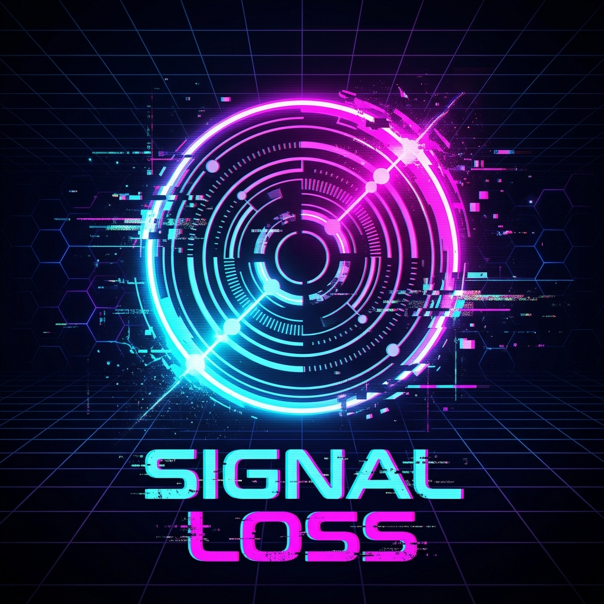

<p align="center">
  
</p>

# ⚡ Signal Loss — Arcade Survival

[](https://opensource.org/licenses/MIT)
[]()
[]()

> A high-octane, 90-second arcade survival game set in a dark, grid-based data-field. Dodge corrupted data packets, exploit invincibility frames, score near-miss bonuses, and survive the digital storm.

---

## 🌌 The Premise
You are a central node in a decaying network. Corrupted data packets are flooding the system. Your task is simple: maintain link integrity and survive the signal loss for as long as possible. The system is adaptive—it watches your performance and increases the pressure when you start to cruise.

---

## 🚀 Key Features

*   **Dynamic Difficulty Director (DDD):** Rather than using a static timer-based curve, an internal director constantly tracks your "pressure score" (based on dash usage and near-misses). If you're cruising, it ramps up the speed and frequency of hazards; if you're struggling, it dynamically backs off.
*   **Three Cyberpunk Hazard Types:**
    *   🟣 **Drifters (Magenta):** Straight-line, fast-moving packets. Available from $t=0$.
    *   🟠 **Seekers (Orange):** Homing packets with limited steering that track your movements ($t > 15s$).
    *   🔴 **Pulses (Red):** Stationary packets that telegraph warning rings before expanding into massive local blast zones ($t > 30s$).
*   **Tactical Dash:** Trigger a high-speed propulsion burst with **150ms of invincibility** to escape tight situations.
*   **Near-Miss System:** Stand your ground! Dodge packets at the last second to trigger spark bursts and collect critical score bonuses.
*   **Sensory Easing:** Featuring screen-shakes, hit-stops (a brief 2-frame freeze on collision), dynamic particle engines, and a procedural synthesizer that intensifies the ambient soundtrack as the network becomes more chaotic.

---

## 🎮 How to Play

### Controls Reference

| Action | Keyboard | Touch / Mobile |
| :--- | :--- | :--- |
| **Movement** | `W`/`A`/`S`/`D` or Arrow Keys | Drag finger on screen (node follows finger) |
| **Dash (I-Frames)**| `Space` or `Shift` | Tap screen anywhere |
| **Start / Restart** | `Space` or `Enter` | Tap screen |

---

## 🛠️ System Architecture

The codebase is built with zero external dependencies using modular ES6 JavaScript.

```
SignalLoss/
├── index.html         # HTML5 Canvas container & Google fonts
├── style.css          # Cyberpunk typography and styling
└── src/
    ├── main.js        # Entry point, game loop, and state machine transitions
    ├── state.js       # Game state definitions & best score tracker
    ├── input.js       # Unified keyboard and touch event normalizer
    ├── player.js      # Player movement physics, dash timers, and trail buffer
    ├── packets.js     # Object-pooled hazards, collision, and near-miss checks
    ├── difficulty.js  # Dynamic Difficulty Director & pressure assessment
    ├── particles.js   # Custom particle emitter for explosions and dashes
    ├── audio.js       # Web Audio API procedural synthesizers & sound effects
    └── render.js      # Canvas renderer, screen-shaker, and CRT-style UI overlay
```

---

## 💻 Running the Game Locally

Due to the use of modern ES6 JavaScript Modules (`type="module"`), browsers block running the files directly from the local file system (`file://` protocol) due to CORS policies. You must run the game using a local web server.

### Option 1: Using Node.js (Recommended)
If you have Node.js installed, serve the folder instantly:
```bash
npx serve -p 8080 .
```
Then open [http://localhost:8080](http://localhost:8080) in your browser.

### Option 2: Using Python
If you have Python installed, run:
```bash
python -m http.server 8080
```
Then open [http://localhost:8080](http://localhost:8080) in your browser.

---

## 🎨 Visual Design Systems
*   **Palette:** Sleeves of neon magenta `#ff3355`, electric blue `#00f7ff`, and danger red `#ff0055` offset by deep terminal dark `#020208`.
*   **Fonts:** `Orbitron` and `Share Tech Mono` via Google Fonts.